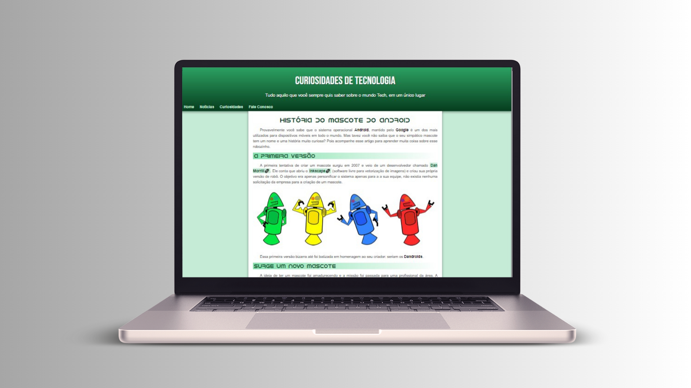

<h1 align="center">A História do Mascote do Android </h1>

Esse foi um desafio proposto no curso <strong> HTML5 E CSS3: MÓDULO 2 DE 5</strong> do <a href="https://www.youtube.com/c/CursoemV%C3%ADdeo">Curso em Vídeo.</a>  
A ideia inicial é criar um site de notícias, nesse caso, contando como surgiu o mascote do Android.

  

## 💻 Tecnologias

Esse projeto foi desenvolvido com as seguintes tecnologias:

- HTML e CSS

## 💻 Projeto

O objetivo desse projeto foi colocar em prática o conteúdo apresentado no curso através de um site de notícias.

Nesse módulo, foi possível aprender sobre cores, fontes e conhecer ferramentas que podem facilitar na hora de trabalhar com elas. Além de aprender mais sobre seletores personalizados em CSS, modelo de caixa e passos para iniciar um projeto.

- [Acesse o projeto finalizado online](https://thalitaad.github.io/mascote-do-android/)
